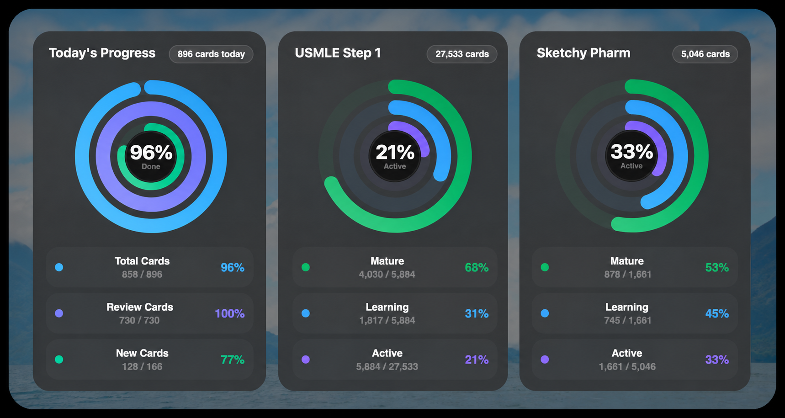
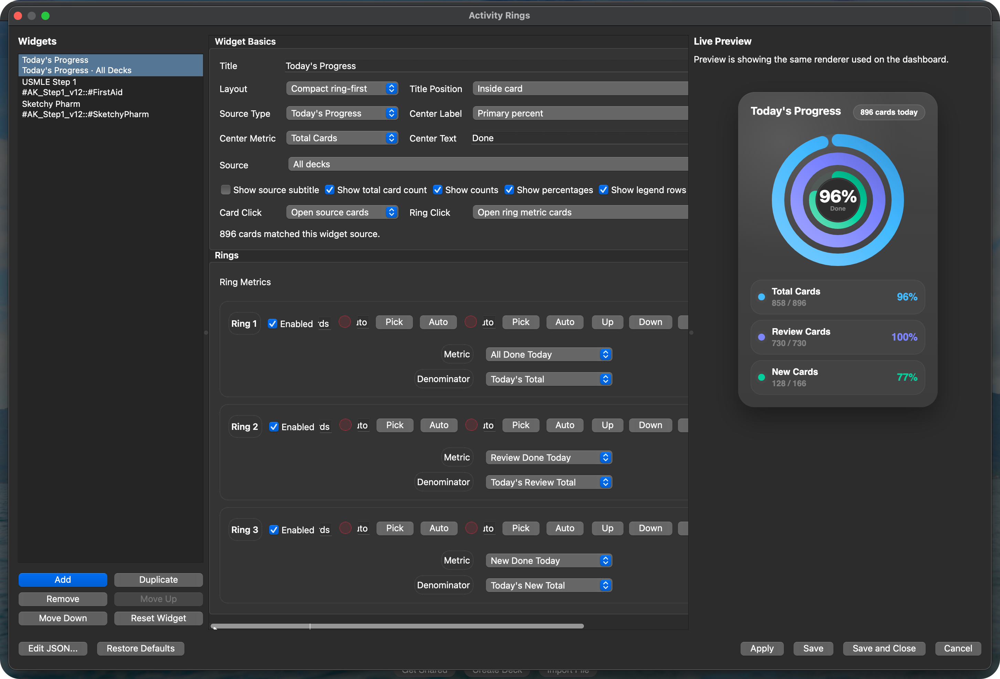

# Activity Rings

`Activity Rings` is an Anki desktop add-on that adds configurable Apple Fitness-style ring widgets to the deck browser and deck overview screens.



Compatibility target:

- Anki desktop 23.x and 24.x
- tested locally against Anki 25.07.x APIs during development

The add-on now supports:

- a visual settings window instead of forcing JSON editing
- ring-first compact cards plus wide detailed cards
- tag, arbitrary search, or today's-progress sources
- explicit numerator/denominator semantics per ring
- built-in metrics plus custom search metrics
- click-through to the Anki Browser
- theme-aware cards that integrate with normal Anki dashboards

## Install

1. Copy the `anki_activity_rings` folder into your Anki `addons21` directory.
2. Restart Anki.
3. Open `Tools -> Activity Rings`.

On macOS, the add-on folder is usually:

`~/Library/Application Support/Anki2/addons21`

Alternatively, download and double click the `activity-rings.ankiaddon` to install the addon. 

## Use The Visual Editor

Open `Tools -> Activity Rings` or `Tools -> Add-ons -> Activity Rings -> Config`.

The editor is organized into:

- a left sidebar for adding, duplicating, removing, and reordering widgets
- a main editor for widget source, layout, ring semantics, and appearance
- an always-visible live preview that uses the same renderer as the dashboard

You can also:

- choose which ring drives the center percentage/count
- override the center caption text
- change the center percent text size
- keep all dashboard cards the same size with `Match widget sizes`
- place the dashboard above or below the rest of the deck browser / overview content

### Source Modes

Each widget can use one source:

- `Tag`: choose a tag, with optional child-tag inclusion
- `Deck`: choose a deck
- `Search`: use any Anki search query as the widget source
- `Today's Progress`: show today's new/review progress for all decks or one specific deck

Examples:

- `tag` source: `#AK_Step1_v12::FirstAid`
- `search` source: `deck:"Step 1" -is:suspended`
- `today` source: all decks, or one deck such as `Step 1::Pharm`

Tag matching tolerates optional leading `#` on tag segments, so `#Parent::#Child` and `Parent::Child` resolve to the same hierarchy.
If a tag source is left empty on purpose, the widget stays saveable as a placeholder, shows empty rings with `Tag Empty`, and clicking that dashboard card opens the standalone tag picker.



### Ring Semantics

Each ring has:

- `metric`: the numerator rule
- `denominator`: the denominator rule

Built-in metric choices include:

- `all`
- `mature`
- `young`
- `unsuspended`
- `suspended`
- `buried`
- `new`
- `non_new`
- `learning`
- `review`
- `due`
- `leech`
- `reviewed`
- `today_review_completed`
- `today_review_total`
- `today_new_completed`
- `today_new_total`
- `today_all_completed`
- `today_all_total`

You can also use `Custom Search` for either the numerator or denominator.

Examples:

- `Mature / Unsuspended`
- `Young/Learning / Unsuspended`
- `Unsuspended / All`
- `Due Today / Unsuspended`
- `Custom Search / Custom Search`

### Default Ring Presets

New installs and `Restore Defaults` now start with three widgets:

1. `Today's Progress`
2. `Tag`
3. `Tag`

The two study-source widgets intentionally start as empty tag placeholders so you can assign your own tags without editing JSON. Clicking either placeholder card on the dashboard opens the tag picker, and after you choose a tag you can immediately set the widget title.

That keeps the daily default motivating, while tag/search widgets still use honest maturity/availability semantics instead of pretending every ring is “completion.”

## Click Actions

Widgets can open the Anki Browser:

- clicking the card can open the widget source
- clicking the ring can open the primary metric or the source
- clicking a metric row can open that metric’s numerator query
- if a tag widget has no tag selected yet, clicking the card opens the standalone tag picker instead

This makes the dashboard usable for drill-down, not just display.

## JSON Still Works

The visual editor is the main workflow, but JSON config still works.

- `Edit JSON...` is available inside the visual editor
- malformed JSON is normalized safely where possible
- invalid widgets are repaired or skipped with warnings instead of crashing Anki

## Example JSON

```json
{
  "global": {
    "show_on_screens": ["deckBrowser", "overview"],
    "panel_margin": 18,
    "panel_spacing": 16,
    "cache_ttl_seconds": 30,
    "hide_when_no_widgets": false,
    "dashboard_position": "top",
    "theme": "auto",
    "palette": "soft",
    "default_card_style": "native",
    "debug_timing": false
  },
  "widgets": [
    {
      "id": "first_aid",
      "title": "First Aid",
      "source": {
        "type": "tag",
        "tag": "#AK_Step1_v12::FirstAid",
        "include_children": true
      },
      "layout": {
        "mode": "compact",
        "title_position": "inside",
        "show_source_subtitle": false,
        "show_total_cards": true,
        "show_legend": true,
        "show_counts": true,
        "show_percentages": true,
        "ring_size": 204,
        "ring_thickness": 18,
        "ring_gap": 8,
        "card_min_width": 290,
        "card_max_width": 390,
        "card_aspect_ratio": 1.08,
        "card_padding": 18,
        "center_label_mode": "primary_percent",
        "primary_ring_id": "mature",
        "center_label_text": "",
        "center_value_font_size": 30,
        "center_value_auto_fit": true,
        "center_caption_font_size": 11,
        "center_caption_auto_fit": true,
        "click_action": "source",
        "ring_click_action": "numerator"
      },
      "style": {
        "background_color": "auto",
        "card_opacity": 0.92,
        "border_color": "auto",
        "shadow_enabled": true,
        "track_color": "auto",
        "use_glow": false
      },
      "rings": [
        {
          "id": "mature",
          "enabled": true,
          "label": "Mature",
          "metric": { "type": "builtin", "name": "mature" },
          "denominator": { "type": "builtin", "name": "unsuspended" },
          "color": "auto",
          "track_color": "auto"
        },
        {
          "id": "young",
          "enabled": true,
          "label": "Young/Learning",
          "metric": { "type": "builtin", "name": "young" },
          "denominator": { "type": "builtin", "name": "unsuspended" },
          "color": "auto",
          "track_color": "auto"
        },
        {
          "id": "active",
          "enabled": true,
          "label": "Unsuspended",
          "metric": { "type": "builtin", "name": "unsuspended" },
          "denominator": { "type": "builtin", "name": "all" },
          "color": "auto",
          "track_color": "auto"
        }
      ]
    }
  ]
}
```
